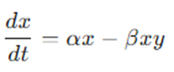
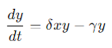

# Trabajo Practico Integrador
El modelo Presa-Depredador hace referencia al modelo Lotka-Volterra que consiste en un par de ecuaciones diferenciales que describe las dinámicas de dos poblaciones en interacción: una población de presas y una población de depredadores.

Este modelo se puede clasificar como un modelo no lineal simple, ya que todas sus variables dependen fuertemente de las condiciones iniciales. Esto trae como consecuencia, que una leve variación o incertidumbre en el conocimiento de estas condiciones iniciales, modificará la posición final del sistema. Esta no linealidad se manifestará como un producto, cociente o exponenciación de dos variables del sistema.

El modelo básico se puede expresar mediante el siguiente sistema de ecuaciones diferenciales:

* Ecuación para la población de presas (x):
 

	α: tasa de crecimiento de las presas en ausencia de depredadores.
	𝛽: tasa a la que las presas son capturadas por los depredadores.

* Ecuación para la población de depredadores (y):

 
	δ: tasa a la que los depredadores aumentan al consumir presas.
	γ: tasa de muerte de los depredadores en ausencia de presas.

### Explicación del modelo

	Crecimiento de presas: En ausencia de depredadores (𝑦=0), la población de presas crece exponencialmente a una tasa 𝛼.
	Captura de presas: La interacción entre presas y depredadores está representada por el término 𝛽𝑥𝑦. Cuantas más presas (𝑥) y depredadores (𝑦) haya, más capturas ocurren.
	Crecimiento de depredadores: Los depredadores crecen en proporción al número de presas que capturan (𝛿𝑥𝑦).
	Muerte de depredadores: En ausencia de presas (𝑥=0), la población de depredadores disminuye exponencialmente a una tasa 𝛾.

## Ejemplo de modelación

Seleccionamos dos poblaciones, una de zorros y otra de liebres en un campo cerrado natural, donde no intervienen otros animales. Los zorros serian los predadores que cazan a las liebres y se alimentan con ellas. Si no existiesen zorros, las liebres se multiplicarían siempre y cuando el terreno sea capaz de proveerles alimentos. Si este limite terrenal es alcanzado, las liebres restantes mueren y la población se estabiliza. Si el caso fuera al revés y no existiesen las liebres, los zorros no tendrían alimento por lo que podrían sobrevivir un cierto tiempo pero luego morirían de hambre. 

Al coexistir ambas poblaciones, se estabilizan las tasas de crecimiento y de perdida. Los zorros se alimentarían de las liebres y se multiplicarían gracias a la caza. Sin embargo, esto también tiene un limite ya que a medida que crece la población de zorros y se reduce la de liebres, la cantidad de alimento con la que ayuda a crecer a los zorros disminuye. Mientras mas numerosa se hace la población de zorros, menos liebres alcanzaran. Con esto la población de zorros se estabilizará. 

A pesar de que es un sistema básico que funciona de manera simple, posee muchas variaciones y oscilaciones que pueden afectar el sistema. El comportamiento de este va a depender principalmente de la cantidad de zorros (predadores) y liebres (presas) iniciales que existan en el entorno, como así también de las tasas de natalidad y mortalidad de cada especie.

## Simulación

Para realizar la simulación debemos definir las variables iniciales determinantes del modelo, es decir, aquellas que van a definir el resultado final del sistema. Usaremos las siguientes variables iniciales:

	Liebres: 500
	Zorros: 10
	Capacidad total del terreno: 1000
	Tasa de crecimiento de Liebres: 0,08
	Tasa de sobrevivencia de los Zorros (solo por respirar): 0,2
	Dt (referencia a la semana actual): 1

El evento Caza es el evento principal que relaciona a las dos poblaciones. Siempre que ocurre este evento, una de las poblaciones se ve beneficiada y otra perjudicada. Concretamente la población de los zorros (predadores) se ve beneficiada ya que se alimentan de las liebres (presas).

La relación Casa entre zorros y liebres es el producto de la cantidad total de liebres por la cantidad total de zorros: 

    500 liebres * 10 zorros = 5000 encuentros

Gracias al resultado de este evento, el valor de la natalidad de los zorros aumenta, así como también es reducido el crecimiento neto de las liebres.

Algunos zorros sobreviven solo por respirar, este valor esta dado por la tasa de sobrevivencia de los zorros, que a su vez determina el valor de la tasa de mortalidad de esa población. 

    Tasa de sobrevivencia de los zorros = 0,2 (Solo el 20% sobreviven solo por respirar)
 
Esto además ayuda a determinar qué porcentaje de la población de zorros, sobreviviría en el hipotético caso que no tengan presas que cazar.

    Sobrevivencia de zorros = 0,2 * 10 zorros = 2 zorros

Por cada liebre cazada, sobreviven una especifica cantidad de zorros. Esto se denomina tasa de crecimiento por encuentro.

    Tasa de crecimiento por encuentro= 2 zorros / 5000 encuentros = 0,0004 zorros

A su vez, las liebres que son cazadas reducen la población total de las presas. Esto se denomina tasa de perdida por encuentro.

    Tasa de perdida de liebres por encuentro = 10 zorros / 5000 encuentros = -0.002 liebres

Posteriormente al evento Caza, podemos apreciar que ambas poblaciones se ven afectadas por las tasas de crecimiento y perdida por encuentro, lo cual nos hace concluir que el modelo describe correctamente el hipotético evento. Ahora debemos calcular los nuevos valores de población utilizando las tasas de crecimiento y perdida.

#### Población de Liebres

En el caso de las liebres, tenemos que determinar 3 variables:

* Población actual: Esta es determinada por el numero de liebres actuales que hay durante la caza. 
    
        Liebres = 500

* Tasa de liebres (nacimiento): Esta es determinada considerando la tasa de crecimiento pasiva de las liebres, así como también de la capacidad terrena que tienen. 
Las liebres pueden crecer sin control siempre y cuando no sean cazadas por sus predadores y tengan la capacidad terrenal adecuada para sobrevivir. Su tasa de crecimiento es del 8% con alimento y sin zorros.

        Tasa de crecimiento de las liebres = 0,08 (Equivale a su natalidad)

    Para calcular la capacidad actual del terreno se debe determinar la cantidad actual de liebres que hay y la capacidad total del terreno. De esa manera podemos calcular si las liebres tienen aún espacio para poder crecer en un entorno libre.

        Capacidad total del terreno = 1000
        Liebres actuales = 500
        Capacidad actual = Capacidad total del terreno - Liebres actuales
        Capacidad actual = 500

    Esto quiere decir que las liebres actualmente tienen suficiente espacio para poder seguir creciendo libremente siempre y cuando no haya zorros que las cacen.

    Ahora calculamos la tasa de nacimiento de liebres actual:
        Tasa de liebres (nacimiento)=(1/(Cap Terreno))*Cap Actual*Tasa de crecimiento*Liebres

        Tasa de liebres (nacimiento)= (1/1000)*500*0,08*500= 20 

* Tasa de muerte de liebres (mortalidad): Esta equivale al producto entre el evento Caza y la tasa de perdidas.

        Tasa de muerte de liebres (mortalidad) = Tasa de pérdida de liebres por encuentro * Caza 

        Tasa de muerte de liebres (mortalidad) = 0,002 * 5000 = 10 

    Finalmente, teniendo estas 3 variables, procedemos a calcular el valor de población actual.

        Población de Liebres = Liebres + dt*(Tasa de liebres - Tasa de muerte)
        Población de Liebres = 500 + 1*(20-10) = 510

#### Población de Zorros
En el caso de los zorros, debemos también determinar 3 variables:

* Población actual: Dada por el numero de zorros actuales que hay durante la caza.

        Zorros = 10

* Tasa de zorros (nacimiento): Se calcula con el producto entre la tasa de crecimiento por encuentro y el evento de caza.

        Tasa de zorros (nacimiento) = Tasa de crecimiento por encuentro * Caza
        Tasa de zorros (nacimiento) = 0.0004 * 5000 = 2

* Sobrevivencia de zorros (muertes): Este valor hace referencia a la cantidad de zorros que sobreviven sin haber cazado ninguna presa, y está dado por la tasa de sobrevivencia (solo por respirar) de los zorros.

        Sobrevivencia de zorros = 0,2 * 10 zorros = 2 zorros
 
    Una vez calculadas las 3 variables, procedemos a calcular el valor de población.
        Población de Zorros = Zorros + dt*(Tasa de zorros - Sobrevivencia de zorros )
        Población de Zorros = 10 + 1*(2-2) = 10

## Diagrama de efecto

En este diagrama de efecto podemos ver todas las variables que se interrelacionan y que afectan al modelo en sí. Además, podemos apreciar que el sistema tiene varias realimentaciones, que dependiendo del peso de cada una hará que la balanza se incline hacia a una especie u otra.
 
## Nueva Funcionalidad: Ciclo estacional

En una modelación real, las tasas de crecimiento de las poblaciones de animales suelen variar con las estaciones. Por ejemplo, la disponibilidad de alimentos para las liebres puede aumentar en primavera y verano y disminuir en otoño e invierno. Incorporar una variación estacional le agrega mayores valores de realismo al modelo tales como:

* Oscilaciones Naturales: Las poblaciones de presas y depredadores en la naturaleza tienden a mostrar oscilaciones periódicas que pueden estar influenciadas por cambios estacionales. La inclusión de una componente estacional puede generar oscilaciones más realistas y complejas en la simulación.

* Predicción de Picos y Valles: Al modelar las variaciones estacionales, se pueden predecir de manera más precisa los picos y valles en las poblaciones de presas y depredadores, lo que puede ser crucial para estudios ecológicos y de conservación.

* Interacciones Complejas: Las variaciones estacionales pueden influir en las interacciones entre presas y depredadores. Por ejemplo, durante los meses más fríos, la disponibilidad de presas puede disminuir, afectando la supervivencia y reproducción de los depredadores.
 
¿Como podemos definir esto en el modelo de Lotka-Volterra? Definiendo una fórmula del Ciclo Estacional.
 
Donde:

    𝛼0 es la tasa base de crecimiento de las presas en ausencia de variaciones estacionales.
    𝐴 es la amplitud de la variación estacional, que determina la magnitud del cambio en la tasa de crecimiento.
    𝑡 es el tiempo.
    𝑇 es el periodo de la variación estacional (por ejemplo, un año en días).
    sin(2πt/T) es una función sinusoidal que varía entre -1 y 1 a lo largo del tiempo.

#### Ejemplo de Código

En este código hecho en Python podemos observar la representación de la formula del ciclo estacional que determinara la tasa de crecimiento de las presas (en este caso liebres).
Nueva funcionalidad: Evaluación de Sobrepoblación

Muchas veces, al existir una sobrepoblación en una especie, puede afectar el ecosistema del entorno ya que se corre probabilidad de que se extinga la otra población. Por ejemplo, si existiera el caso de que existen muchos depredadores y pocas presas, hay una alta probabilidad de que las presas terminen muriendo todas y eso eventualmente dañaría al ecosistema ya que además, los depredadores morirían de hambre.

Incorporar una funcionalidad para evaluar la sobrepoblación ayudaría a estabilizar el ecosistema. Para ello, se necesitaría el siguiente enfoque

* Definición de Sobrepoblación: Añadir un término que representa la sobrepoblación relativa de una especie.
* Impacto de la Sobrepoblación: Modificar las tasas de mortalidad para incluir los efectos de la sobrepoblación. Por ejemplo, si la población de presas excede un cierto umbral, aumentar la tasa de mortalidad debido a la competencia intraespecífica o la falta de recursos.
 
#### Ejemplo de código
 
En este ejemplo del código de Python, podemos observar que las variables “overpop” calculan la sobrepoblación que existe en el caso hipotético que superen a la capacidad terrenal determinada en las variables K y Z.

A su vez, en las ecuaciones diferenciales, se añade un termino de mortalidad adicional para las liebres y zorros proporcional a la sobrepoblación que posean. Los términos (hare_overpop * 0.01 * x y fox_overpop * 0.01 * y) representan el aumento en la tasa de mortalidad debido a la sobrepoblación. El factor 0.01 es un coeficiente ajustable para representar la intensidad del impacto de la sobrepoblación.

